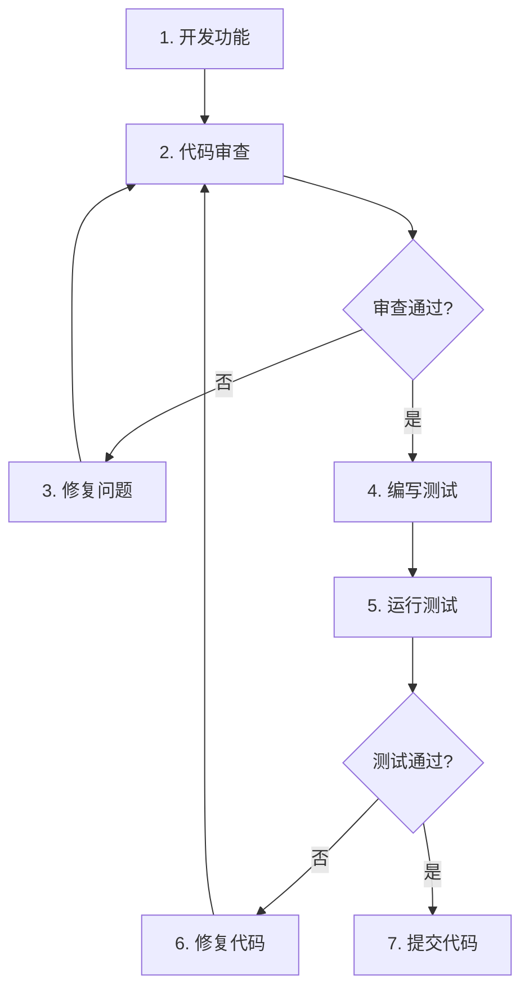

# Opus-ERP Agent 使用指南

> 本文档介绍如何使用 Claude Code Agent 来辅助开发、审查和测试。

---

## 1. Agent 概览

| Agent | 调用方式 | 用途 |
|-------|----------|------|
| 代码审查员 | `@erp-code-reviewer` | 审查代码是否符合架构规范 |
| 测试工程师 | `@erp-tester` | 编写单元测试和 E2E 测试 |
| 架构审查员 | `@erp-architect` | 审查新增模块/表/API 是否符合整体规划 |

---

## 2. 代码审查员使用方法

### 2.1 审查单个文件

```
@erp-code-reviewer 请审查 PoOrderService.java
```

### 2.2 审查多个文件

```
@erp-code-reviewer 请审查 purchase 模块下的所有 Service 文件
```

### 2.3 审查 Git Diff

```
@erp-code-reviewer 请审查我刚才提交的代码改动
```

### 2.4 审查特定问题

```
@erp-code-reviewer 请检查这个文件有没有直接操作库存表的问题
```

### 2.5 审查输出示例

```markdown
## 审查结果

### 发现 2 个问题

**问题 1: [CRITICAL] PoOrderService.java:45**
- 问题：直接使用 `stockMapper.updateById()` 更新库存
- 建议：应该调用 `InvTransactionService.createReceipt()`

**问题 2: [HIGH] PoOrder.java:23**
- 问题：金额字段使用了 `Double` 类型
- 建议：改为 `BigDecimal` 类型

### 审查结论
❌ 审查未通过，请修复上述问题后重新提交。
```

---

## 3. 测试工程师使用方法

### 3.1 为 Service 编写单元测试

```
@erp-tester 请为 PoOrderService.java 编写单元测试
```

### 3.2 为 Controller 编写测试

```
@erp-tester 请为 PoOrderController.java 编写单元测试
```

### 3.3 编写 E2E 测试

```
@erp-tester 请为采购订单模块编写 Playwright E2E 测试
```

### 3.4 为特定方法编写测试

```
@erp-tester 请为 PoOrderService.auditOrder() 方法编写测试，覆盖正常和异常场景
```

### 3.5 测试输出示例

```java
package com.opus.erp.purchase.service.impl;

import org.junit.jupiter.api.Test;
import org.junit.jupiter.api.DisplayName;
import static org.junit.jupiter.api.Assertions.*;

@DisplayName("采购订单服务测试")
class PoOrderServiceImplTest {

    @Test
    @DisplayName("审核订单 - 成功")
    void auditOrder_Success() {
        // 测试代码...
    }

    @Test
    @DisplayName("审核订单 - 非草稿状态抛异常")
    void auditOrder_NotDraft_ThrowsException() {
        // 测试代码...
    }
}
```

---

## 4. 实际工作流程

### 4.1 开发新功能后的标准流程



### 4.2 完整示例

**步骤 1：开发功能**
```
我已经完成了采购订单创建功能，请帮我审查一下。
```

**步骤 2：代码审查**
```
@erp-code-reviewer 请审查以下文件：
- src/main/java/com/opus/erp/purchase/PoOrderController.java
- src/main/java/com/opus/erp/purchase/PoOrderService.java
- src/main/java/com/opus/erp/purchase/entity/PoOrder.java
```

**步骤 3：根据审查结果修复**
```
根据审查结果，我已修复了以下问题：
1. 将 Double 改为 BigDecimal
2. 添加了 InvTransactionService 调用

请再次审查。
```

**步骤 4：编写测试**
```
@erp-tester 请为 PoOrderService 编写单元测试，覆盖以下场景：
1. 创建订单成功
2. 供应商ID为空抛异常
3. 审核订单成功
4. 非草稿状态审核抛异常
```

**步骤 5：运行测试**
```
请运行刚才生成的测试。
```

**步骤 6：提交代码**
```
测试全部通过，请帮我提交代码，commit message 为：
feat(purchase): 实现采购订单创建功能
```

---

## 5. 高级用法

### 5.1 批量审查

```
@erp-code-reviewer 请审查 inventory 模块的所有文件，重点关注：
1. 是否有直接操作 inv_stock 表的地方
2. 是否有使用 Double 类型存储金额
```

### 5.2 对比审查

```
@erp-code-reviewer 请对比 PoOrderService 和 SoOrderService，检查它们的实现是否一致
```

### 5.3 生成测试报告

```
@erp-tester 请为整个 purchase 模块生成测试覆盖率报告
```

### 5.4 修复建议

```
@erp-code-reviewer 审查后请给出具体的修复代码示例
```

---

## 6. 常见问题

### Q1: Agent 没有响应怎么办？

**A:** 检查以下几点：
1. `.claude/agents/` 目录下是否有对应的 `.md` 文件
2. 文件是否包含正确的 YAML frontmatter（`---` 包裹的部分）
3. 文件名是否正确（如 `code-reviewer.md`）

### Q2: 如何修改 Agent 的行为？

**A:** 直接编辑对应的 `.md` 文件即可：
- 修改审查规则：编辑 `code-reviewer.md` 的"审查清单"部分
- 修改测试模板：编辑 `tester.md` 的"测试模板"部分

### Q3: 可以创建其他 Agent 吗？

**A:** 可以！在 `.claude/agents/` 目录下创建新的 `.md` 文件即可。例如：
- `database-expert.md` - 数据库专家
- `frontend-reviewer.md` - 前端审查员
- `api-designer.md` - API 设计师
- `architect.md` - 架构审查员（已内置）

### Q4: Agent 使用的是什么模型？

**A:** 在 `.md` 文件的 YAML frontmatter 中指定：
```yaml
model: sonnet  # 可选：sonnet, opus, haiku
```

---

## 7. 最佳实践

### ✅ 推荐做法

1. **开发完成功能后立即审查**
   ```
   @erp-code-reviewer 审查我刚才写的代码
   ```

2. **审查通过后再编写测试**
   ```
   @erp-tester 为 xxxService 编写测试
   ```

3. **测试通过后再提交**
   ```
   git commit -m "feat(xxx): 实现xxx功能"
   ```

4. **定期批量审查**
   ```
   @erp-code-reviewer 审查整个模块的代码
   ```

### ❌ 避免做法

1. **不要跳过审查直接提交**
2. **不要忽略审查结果中的 CRITICAL 问题**
3. **不要编写没有断言的测试**
4. **不要在测试中使用真实数据库**

---

## 8. Agent 配置参考

### 代码审查员配置

```yaml
---
name: erp-code-reviewer
description: 负责审查 Java 代码是否符合 OpusERP 的架构规范
tools:
  - Read
  - Grep
  - Glob
  - Agent
model: sonnet
permissionMode: readonly
---
```

### 测试工程师配置

```yaml
---
name: erp-tester
description: 负责编写单元测试和 E2E 测试
tools:
  - Read
  - Write
  - Bash
  - Glob
  - Grep
model: sonnet
---
```

> **注意**：上述 `tools` 列表为示意。实际配置时，工具名必须与当前 Claude Code / Agent 运行环境支持的 tool schema 一致。若环境不支持 `Bash` 或 `Agent`，应替换为实际可用的工具（如 `RunCommand` 等），否则 Agent 可能无法正常工作。

---

## 9. 自定义 Agent 模板

### 创建新的 Agent

在 `.claude/agents/` 目录下创建新的 `.md` 文件：

```markdown
---
name: my-agent
description: 我的自定义 Agent
tools:
  - Read
  - Write
  - Bash
model: sonnet
---

# 角色：xxx

## 目标
描述 Agent 的目标

## 工作流程
1. 步骤1
2. 步骤2
3. 步骤3

## 输出格式
描述输出格式
```

### 常用工具列表

| 工具 | 用途 |
|------|------|
| `Read` | 读取文件 |
| `Write` | 写入文件 |
| `Edit` | 编辑文件 |
| `Bash` | 执行命令 |
| `Grep` | 搜索内容 |
| `Glob` | 搜索文件 |
| `Agent` | 调用其他 Agent |

---

## 10. 相关文档

- [项目宪法](../CLAUDE.md)
- [整体规划](PLAN.md)
- [接口契约](CONTRACTS.md)
- [数据纪律](DATA.md)
- [工作流程](WORKFLOW.md)
- [进度追踪](PROGRESS.md)
